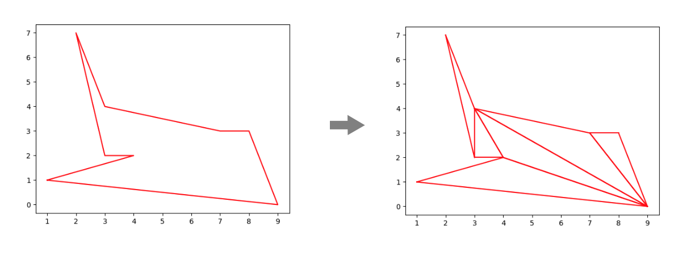

# Triangulator


This package will triangulate any polygon and return a list of triangles




> By now  there is only one algorithm available: ear clipping method

## Installation

```bash
pip install triangulator
```

## Usage

```python
from triangulator.ear_clipping import triangulate

triangles = triangulate(((1, 1), (4, 2), (3, 2), (2, 7), (3, 4), (7, 3), (8, 3), (9, 0)))

print(triangles)
```

## Explanation

The ear clipping method is a simple algorithm that will triangulate any polygon. It works by finding the ears of the polygon and then removing them. The ears are the vertices that are not part of any other triangle. The algorithm will continue until there are no more ears left.

### Algorithm

 1. Find the internal angle of each vertex
2. Check if the angle is less than 180 degrees, skip if not
3. Check if there are any polygon points inside the triangle formed by the vertex and its neighbors
4. If there are no points inside the triangle, then the vertex is an ear
5. If the vertex is an ear, add the triangle to the list of triangles
6. Remove the ear and repeat the process until there are no more ears
